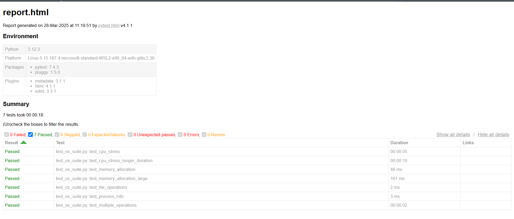

# OS Testing Suite

A comprehensive testing suite for Linux system performance and functionality testing using Docker containers.

## Overview

This testing suite performs various system-level tests including:
- CPU stress testing (using stress-ng)
- Memory allocation testing
- File I/O operations
- Process information monitoring
- Multiple concurrent operations testing

## Detailed Setup Guide

### 1. System Requirements
- Windows 10/11 with WSL2 enabled
- Docker Desktop (latest version)
- Git

### 2. WSL2 Setup (Windows Users)
1. Open PowerShell as Administrator and run:
```bash
wsl --install
```
# Project Structure
os-testing-suite/
├── Dockerfile           # Container configuration
├── docker-compose.yml   # Docker compose configuration
├── main.py             # Main test implementation
├── test_os_suite.py    # PyTest test cases
├── requirements.txt    # Python dependencies
└── reports/           # Test reports directory
## Test Results Summary
- Total Tests: 7
- All tests passed successfully
- Total execution time: 18 seconds
- Test Environment: Linux-WSL2 with Python 3.12.3

## Quick Start

### Prerequisites
- Docker Desktop
- WSL2 enabled (for Windows users)
- Docker Compose
### Project Setup
- Clone the repository:git clone https://github.com/LusmicSam/os-testing-suite.git
- cd os-testing-suite

### Running Tests

1. Build the Docker container:
```bash
docker-compose build
2. Run the tests:
```bash
docker-compose run os-test python3 main.py
3. Run Detailed tests with Reports:
```bash
docker-compose run os-test pytest test_os_suite.py --html=reports/report.html
## Test Results Example

Below is a sample test report output showing all tests passing successfully:



### Test Report Details
- **Environment**: Linux-WSL2, Python 3.12.3
- **Test Duration**: 18 seconds
- **Results Summary**:
  - ✅ CPU Stress Test (5s): PASSED
  - ✅ Extended CPU Stress (10s): PASSED
  - ✅ Memory Allocation (48ms): PASSED
  - ✅ Large Memory Test (161ms): PASSED
  - ✅ File Operations (2ms): PASSED
  - ✅ Process Info (3ms): PASSED
  - ✅ Multiple Operations (2s): PASSED


